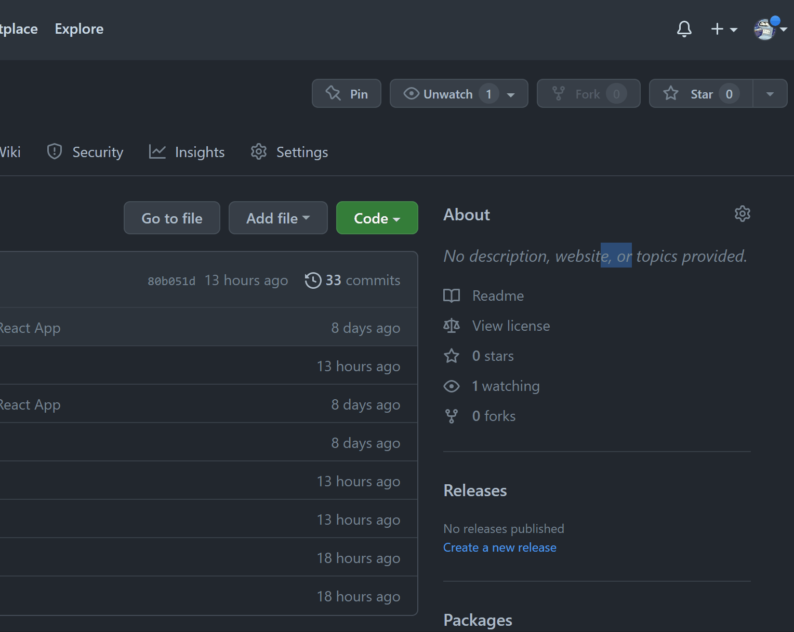
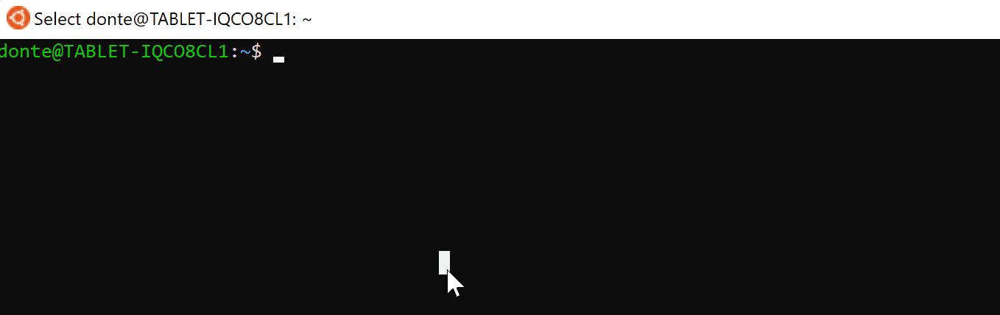

# Pokédex Master

In the world of Pokémon, typically you have catch a Pokémon to read its Pokédex entry.
Pokédex Master is a single page application that challenges users to 'catch' Pokémon <i>after</i> reading their Pokédex entries. You are given a random Pokédex entry for a random Pokémon, and your goal is to guess what it is. Each correct guess adds a new Pokémon to your local Pokédex, and the pool of potential 'wild Pokémon' gets smaller until you've caught 'em all! Spelling counts (<i>sorry!</i>), so you may have to find yourself a list of names on the internet to check your answers against when you're unsure. You can change the size of the wild Pokémon pool that you are playing with by Generation via the Home page, so no worries if you don't know all of the Pokémon. Good luck, have fun, and please don't hesitate to report any issues or bugs (not the Pokémon) that you encounter!
<br>[<b>Here's a video demonstration of how the app works!</b>](https://youtu.be/H_qdlnG3dpU)

## Requirements
Because Pokédex Master uses data from [PokéAPI](https://pokeapi.co/), you need to be connected to the internet to enjoy the app.
You will need to have [Node Package Manager](https://docs.npmjs.com/downloading-and-installing-node-js-and-npm) installed.<br>
You will also need a MongoDB connection string. You can get started with [MongoDB Atlas](https://www.mongodb.com/atlas) for free.

## Installation
In this application's GitHub repo, click the fork button to create a copy for yourself. Next, in your own fork, click the 'Code' button, make sure SSH is selected, and copy what's there.<br><br>
<br><br>
Head into your CLI and navigate to the directory where Pokédex Master will live. Enter the following, pasting in the text you copied:<br><br>
<br><br>
Once it's done, navigate into the new directory:
```terminal
~$ cd Pokedex-Master
```
... and then create a `.env` file:
```terminal
~/Pokedex-Master$ touch .env
```
Inside of that `.env` file, you will be pasting your MongoDB connection string and a session secret. The session secret can be whatever you want it to be, and it is recommended that you change it periodically for security reasons. Check out the `express-session` [docs](https://github.com/expressjs/session#secret) for more details on that.

```
// .env
// be sure to use the exact variable names

DATABASE_URL = mongodb+srv://this-is-an-example-string.mongodb.net/ // replace this with your own connection string

SESSION_SECRET = ["gY0z@B3an$-La689njK#-5dX?g!2sE"] // can be a string or an array of strings; only the first value is used
```
After saving your changes, all that's left to do is install the dependencies:
```terminal
~/Pokedex-Master$ npm install
~/Pokedex-Master$ npm install --prefix client
```
Once that's complete, you are ready to run the application!

## Usage
To get started, make sure you are in the <b>Pokedex-Master</b> directory and type this in your terminal:
```terminal
~/Pokedex-Master$ npm start
```
This starts up the backend server and connects you to your database.<br>
Next, you will need to open a <i>second</i> terminal for the frontend:
```terminal
~/Pokedex-Master$ npm start --prefix client
```
A browser window will open, but don't panic. It's the game!
Head into the browser window at http://localhost:3000/ and create an account. From there you can select a save file and start filling your Pokédex. Enjoy!<br><br>
<i>* Pictured below is an older version; the latest version features Pokédex searching, modes, less strict answer formats, and all Pokémon through Gen 9!</i>


## Contributing
Pull requests are welcome. For major changes, please open an issue first to discuss what you would like to change.


## Acknowledgements
- Pokémon and All Respective Names are Trademark & © of Nintendo 1996-2023
- Pokemon data comes from the great [PokéAPI](https://pokeapi.co/).
- Image on the 'Play' page is from [Bulbapedia](https://bulbapedia.bulbagarden.net/wiki/Main_Page).
- Header graphic created with [Canva](https://www.canva.com/).
- Toasts and Modals from [React Bootstrap](https://react-bootstrap.github.io/).
- Application created using [Create React App](https://create-react-app.dev/).


## License
[MIT](https://choosealicense.com/licenses/mit/)