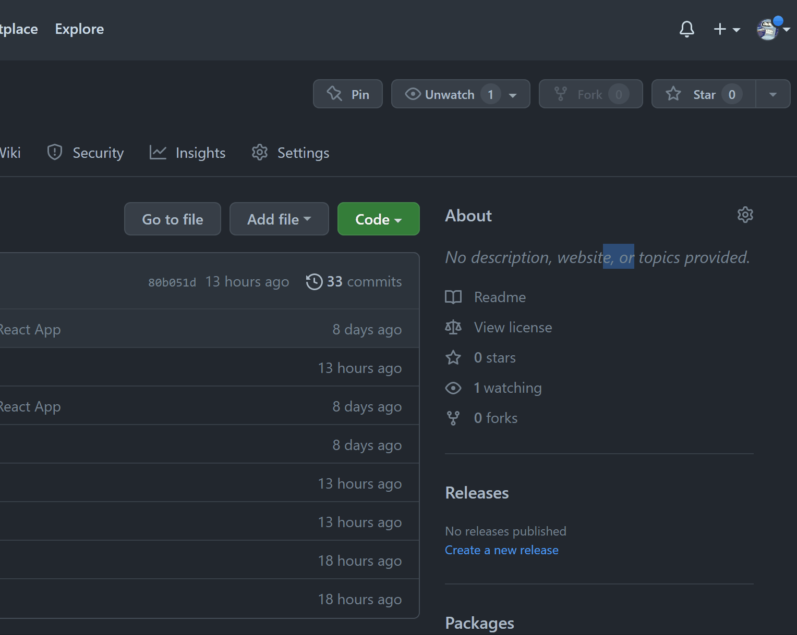

# Pokédex Master

In the world of Pokémon, typically you have catch a Pokémon to read its Pokédex entry.
Pokédex Master is a single page application that challenges users to 'catch' Pokémon <i>after</i> reading their Pokédex entries. You are given a random Pokédex entry for a random Pokémon, and your goal is to guess what it is. Each correct guess adds a new Pokémon to your local Pokédex, and the pool of potential 'wild Pokémon' gets smaller until you've caught 'em all! Spelling counts (<i>sorry!</i>), so you may have to find yourself a list of names on the internet to check your answers against when you're unsure. You can change the size of the wild Pokémon pool that you are playing with by Generation via the Home page, so no worries if you don't know all of the Pokémon. Good luck, have fun, and please don't hesitate to report any issues or bugs (not the Pokémon) that you encounter!
<br>[<b>Here's a video demonstration of how the app works!</b>](https://youtu.be/elvSI0exo80)

## Requirements
You need to be connected to the internet to use Pokédex Master.
You will need to have [Node Package Manager](https://docs.npmjs.com/downloading-and-installing-node-js-and-npm) and [JSON Server](https://www.npmjs.com/package/json-server) installed.<br>
<i>In your CLI (Command Line Interface), enter the following commands:</i>
```terminal
~$ npm install -g npm
~$ npm install -g json-server
```

## Installation
In this application's GitHub repo, click the fork button to create a copy for yourself. Next, in your own fork, click the 'Code' button, make sure SSH is selected, and copy what's there.<br><br>
<br><br>
Head into your CLI and navigate to the directory where Pokédex Master will live. Enter the following, pasting in the text you copied:<br><br>
<br><br>
Once it's done, navigate into the new directory and you're ready to begin using Pokédex Master!
```terminal
~$ cd pokedex-master
```


## Usage
To get started, make sure you are in the <b>pokedex-master</b> directory and type this in your terminal:
```terminal
~/pokedex-master$ npm run server
```
This starts up a mock back-end server. Think of it as a PC box that you'll be sending your captured Pokémon to.<br>
Next, you will need to open a <i>second</i> terminal. Navigate to the correct directory again, this time entering:
```terminal
~/pokedex-master$ npm install && npm start
```
A browser window will open, but don't panic. It's the game! If you entered the commands out of order, don't worry; just refresh the page after both servers are running and everything should work properly.<br>
After that, it's pretty straightforward. Head into the browser window at http://localhost:3000/ and follow the in-app instructions. Enjoy!<br><br>


## Contributing
Pull requests are welcome. For major changes, please open an issue first to discuss what you would like to change.


## Acknowledgements
- Pokémon and All Respective Names are Trademark & © of Nintendo 1996-2023
- Pokemon data comes from the great [PokéAPI](https://pokeapi.co/).
- Image on the 'Play' page is from [Bulbapedia](https://bulbapedia.bulbagarden.net/wiki/Main_Page).
- Mock back end possible thanks to [JSON Server](https://www.npmjs.com/package/json-server).
- Header graphic created with [Canva](https://www.canva.com/).
- Toast messages from [React Bootstrap](https://react-bootstrap.github.io/).
- Application created using [Create React App](https://create-react-app.dev/).


## License
[MIT](https://choosealicense.com/licenses/mit/)